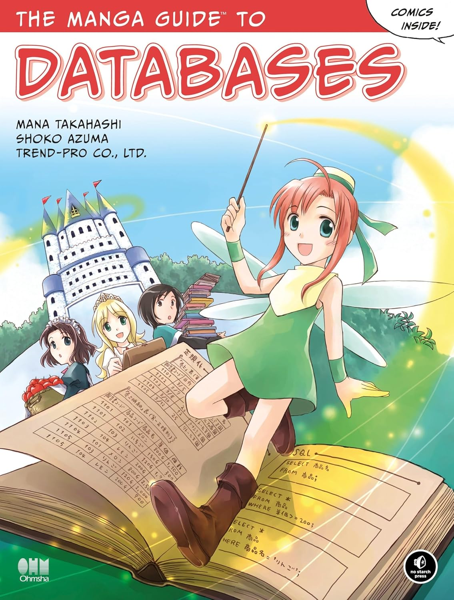

# The Manga Guide to Databases
## Mana Takahashi, Shoko Azuma

### Descripcion
Princess Ruruna is stressed out. With the king and queen away, she has to manage the Kingdom of Kod's humongous fruit-selling empire. Overseas departments, scads of inventory, conflicting prices, and so many customers! It's all such a confusing mess. But a mysterious book and a helpful fairy promise to solve her organizational problems—with the practical magic of databases.
